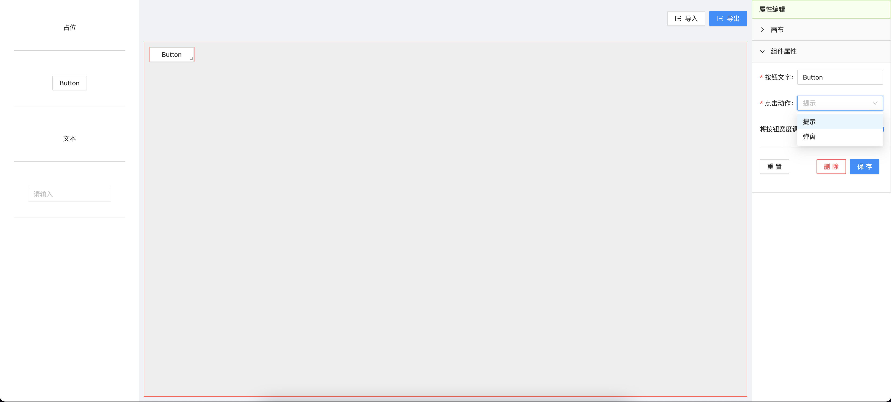

<!--
 * @Author: mrrs878@foxmail.com
 * @Date: 2022-06-26 23:00:28
 * @LastEditors: mrrs878@foxmail.com
 * @LastEditTime: 2022-07-02 23:21:37
-->

# 低代码平台

;

基于 JSON Schema

```shell
.
├── README.md
├── package.json
├── packages
│   ├── editor    # 编辑器，可用来拖拽生成页面，导出配置
│   └── parser    # 解析器，根据导出的配置反解生成页面
├── pnpm-lock.yaml
└── pnpm-workspace.yaml
```

## 启动

``` shell
pnpm install

pnpm start
```
